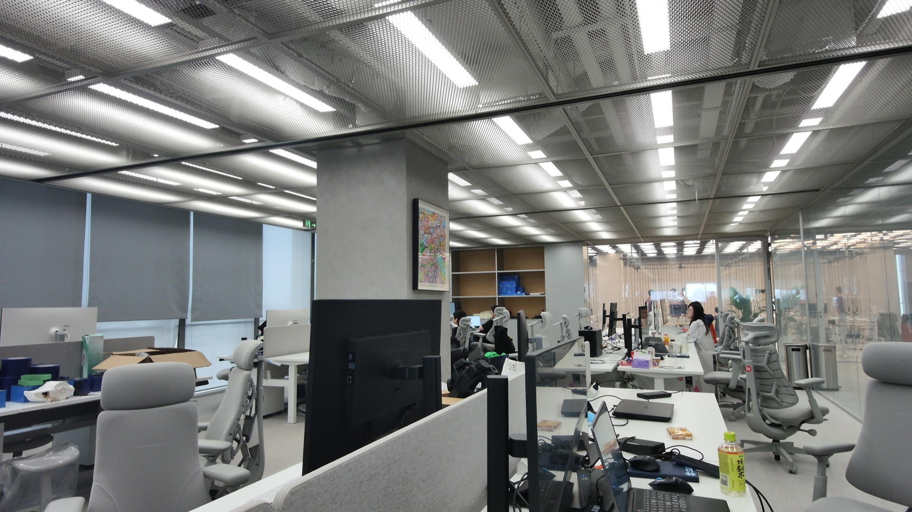
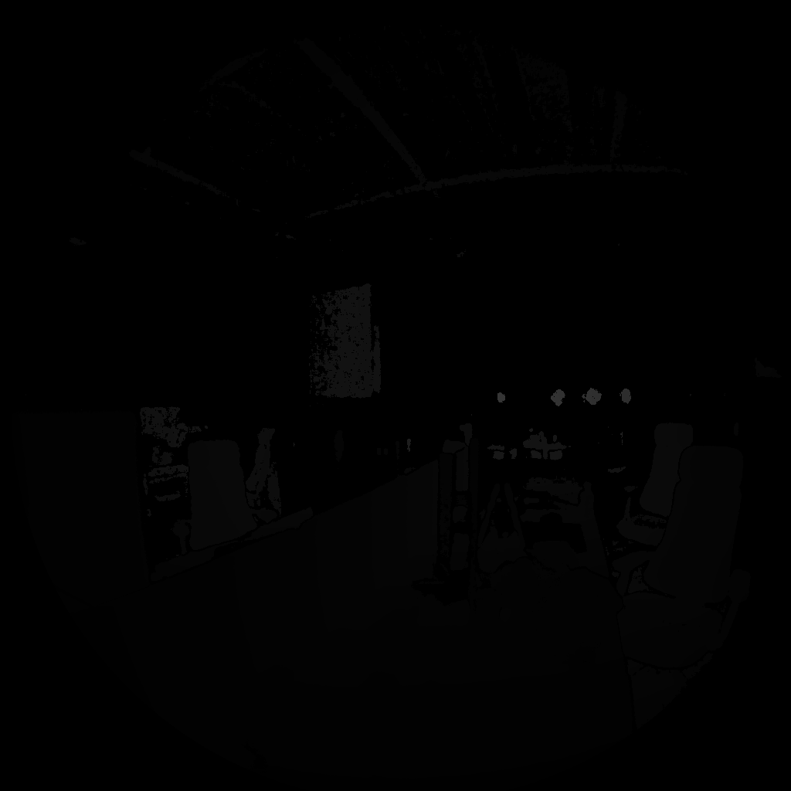
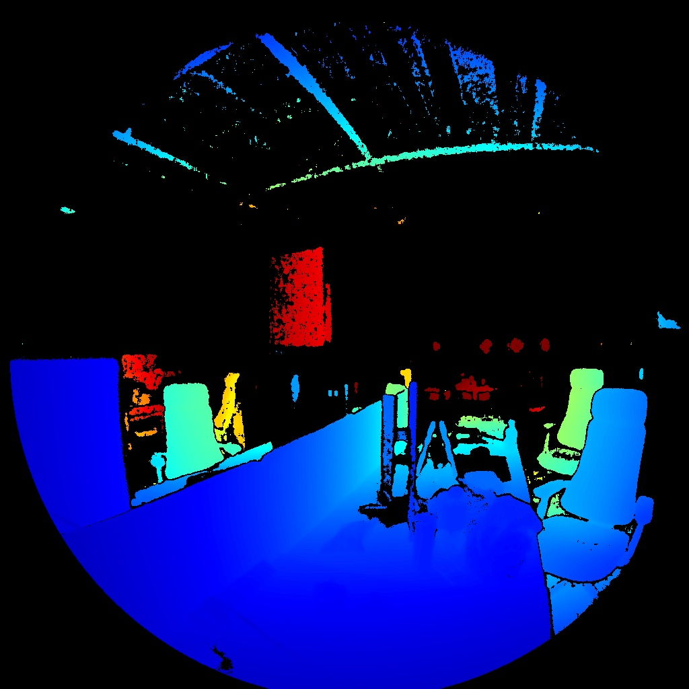

# Orbbec Femto Bolt 采集工具

## 项目简介

本项目用于在 Ubuntu 下使用 Orbbec Femto Bolt 相机进行 RGB 预览、RGB 视频录制、RGB-D 数据保存和相机格式查看。

项目不使用 ROS。RGB 预览和 RGB 视频录制走 Linux UVC/V4L2；RGB-D 数据保存走 Orbbec SDK Python binding。

## 功能

1. RGB 实时预览与截图：`scripts/camera_viewer.py`
2. 查看相机支持格式：`scripts/list_camera_formats.py`
3. 使用 ffmpeg 录制视频：`scripts/record_video_ffmpeg.py`
4. 使用 Orbbec SDK 保存 RGB-D 数据：`scripts/capture_rgbd_orbbec_sdk.py`
5. 使用 Orbbec SDK 按分辨率读取相机内参/畸变：`scripts/read_camera_params.py`

## 项目结构

```text
orbbec/
├── README.md
├── requirements.txt
├── .gitignore
├── docs/
│   └── assets/
│       ├── orbbec_rgb_sample.jpg
│       ├── orbbec_depth_sample.png
│       └── orbbec_depth_pseudo_sample.jpg
├── scripts/
│   ├── camera_viewer.py
│   ├── capture_rgbd_orbbec_sdk.py
│   ├── list_camera_formats.py
│   ├── read_camera_params.py
│   └── record_video_ffmpeg.py
├── outputs/
│   ├── camera_params/
│   ├── screenshots/
│   ├── videos/
│   └── rgbd/
└── tests/
    ├── test_capture_rgbd_orbbec_sdk.py
    └── test_read_camera_params.py
```

`outputs/` 只用于保存运行结果，不作为源码内容提交。历史截图、视频、RGB-D 数据和 SDK 日志已通过 `.gitignore` 忽略。

## 设备节点说明

- `/dev/video2`：Orbbec RGB/UVC 推荐节点，脚本默认使用。
- `/dev/video3`、`/dev/video4`、`/dev/video5`：Orbbec 其他候选节点。
- `/dev/video0`、`/dev/video1`：电脑内置摄像头。
- `/dev/media1`、`/dev/media2`：Orbbec 对应 media 节点。

设备 USB ID：`2bc5:066b`。

## 环境依赖

```bash
pip install -r requirements.txt
sudo apt update
sudo apt install v4l-utils ffmpeg
```

RGB-D 采集脚本依赖 Orbbec SDK Python binding。代码中导入的模块名是 `pyorbbecsdk`；Orbbec SDK v2 的 PyPI 包通常是 `pyorbbecsdk2`。如果 `import pyorbbecsdk` 失败，需要先安装 Orbbec SDK 及其 Python binding。

本机如果没有 `python` 命令，请把下面命令中的 `python` 替换为 `python3`。

## 查看设备

```bash
lsusb | grep -iE "orbbec|2bc5"
v4l2-ctl --list-devices
```

## 查看格式

```bash
python scripts/list_camera_formats.py --device /dev/video2
```

## RGB 预览

```bash
python scripts/camera_viewer.py \
  --device /dev/video2 \
  --width 1280 \
  --height 720 \
  --fps 30 \
  --fourcc MJPG
```

按键：

- `q` / `Esc`：退出
- `s`：保存截图到 `outputs/screenshots/`
- `i`：打印实际相机参数

## 视频录制

最小可运行示例：

```bash
python scripts/record_video_ffmpeg.py \
  --device /dev/video2 \
  --width 3840 \
  --height 2160 \
  --fps 30 \
  --input-format mjpeg \
  --container mp4
```

录像统一保存为 MP4，默认录制到 `outputs/videos/`。高分辨率 MJPG 采集默认使用 `--codec copy`，CPU 压力比实时 H.264 编码低；如果需要更小文件，可以使用 `--codec libx264`。

录制固定时长：

```bash
python scripts/record_video_ffmpeg.py --duration 10 --output outputs/videos/orbbec_10s.mp4
```

## RGB-D 数据保存

最小可运行示例：

```bash
python scripts/capture_rgbd_orbbec_sdk.py \
  --output-dir outputs/rgbd \
  --frames 1
```

RGB-D 数据默认保存到 `outputs/rgbd/`。Depth 默认请求 WFoV unbinned `1024x1024@15fps`；如果需要 5fps，可以显式指定：

```bash
python scripts/capture_rgbd_orbbec_sdk.py \
  --depth-width 1024 \
  --depth-height 1024 \
  --depth-fps 5
```

每次采集会按时间戳创建一个子目录，包含：

- `rgb/`：彩色图，未使用 `--no-color` 时保存。
- `depth/`：深度 `.npy` 和 16-bit PNG。
- `*_depth_preview.jpg`：伪彩色深度预览图，仅使用 `--save-depth-preview` 时保存。
- `*.json`：单帧元数据。
- `manifest.jsonl`：本次采集索引。

当前 README 使用的 GitHub 首页示例图已复制到 `docs/assets/`，原始采集结果来自：

```text
outputs/rgbd/20260612_150336_276/
├── rgb/
│   └── orbbec_rgbd_0001_color.jpg
├── depth/
│   ├── orbbec_rgbd_0001_depth_m.npy
│   ├── orbbec_rgbd_0001_depth_m.png
│   └── orbbec_rgbd_0001_depth_preview.jpg
├── orbbec_rgbd_0001.json
└── manifest.jsonl
```

| RGB | Depth | Pseudo depth |
| --- | --- | --- |
|  |  |  |

该示例使用 `--align-mode sw --save-depth-preview` 保存；Depth 是 16-bit 灰度 PNG，Pseudo depth 按 `0-5m` 做伪彩色映射，黑色区域表示无有效深度。

默认不会输出伪彩色图。如果需要保存一张方便肉眼查看的深度伪彩色图：

```bash
python scripts/capture_rgbd_orbbec_sdk.py \
  --frames 1 \
  --align-mode sw \
  --save-depth-preview
```

伪彩色图默认把 `0-5m` 映射为颜色，可以用 `--depth-preview-max-m` 调整：

```bash
python scripts/capture_rgbd_orbbec_sdk.py \
  --frames 1 \
  --save-depth-preview \
  --depth-preview-max-m 3
```

常用命令：

```bash
python scripts/capture_rgbd_orbbec_sdk.py --list-devices
python scripts/capture_rgbd_orbbec_sdk.py --list-profiles
python scripts/capture_rgbd_orbbec_sdk.py --check-only --no-color
python scripts/capture_rgbd_orbbec_sdk.py --viewer
```

RGB 和 Depth 分辨率不同是正常现象。RGB 常见为 16:9 或 4:3；本项目 Depth 默认统一为 `1024x1024`。不要简单强行 resize 到同一比例；如果需要严格 RGB-D 对齐，应使用 Orbbec SDK 的对齐能力和相机内外参。脚本支持 `--align-mode sw` 或 `--align-mode hw`。

## 读取相机内参和畸变

不同分辨率下使用的内参通常不同。Orbbec SDK 可以按 depth/color 支持的 profile 读取每个分辨率对应的内参和畸变系数。运行：

```bash
python scripts/read_camera_params.py
```

本机没有 `python` 命令时用：

```bash
python3 scripts/read_camera_params.py
```

如果 Orbbec SDK 安装在本项目使用的 `camera` conda 环境中，用：

```bash
conda run -n camera python scripts/read_camera_params.py
```

脚本会按分辨率打印 depth/color 的 `fx`、`fy`、`cx`、`cy`、相机矩阵 `K` 和畸变系数，并保存 JSON 到：

```text
outputs/camera_params/orbbec_camera_params.json
```

只导出 depth 或 color：

```bash
python scripts/read_camera_params.py --sensor depth
python scripts/read_camera_params.py --sensor color
```

JSON 结构示例：

```json
{
  "depth": {
    "1024x1024": {
      "intrinsic": {
        "fx": 505.9272,
        "fy": 505.931,
        "cx": 526.8714,
        "cy": 525.7865,
        "K": [[505.9272, 0, 526.8714], [0, 505.931, 525.7865], [0, 0, 1]]
      },
      "distortion": {
        "k1": 20.8998,
        "k2": 11.2454,
        "p1": 0.0000416,
        "p2": 0.0000541,
        "k3": 0.4346
      },
      "opencv_distortion_k1_k2_p1_p2_k3": [
        20.8998,
        11.2454,
        0.0000416,
        0.0000541,
        0.4346
      ]
    }
  }
}
```

## 测试

离线单元测试不需要连接相机：

```bash
python -m unittest discover -s tests
```

## 常见问题

1. `/dev/video2` 打不开：检查相机是否连接，或尝试 `/dev/video3`、`/dev/video4`、`/dev/video5`。
2. 找不到 `v4l2-ctl`：安装 `v4l-utils`。
3. 不能录制视频：检查 `ffmpeg` 是否安装。
4. RGB-D 脚本无法运行：检查 Orbbec SDK Python binding 是否安装。
5. 请求分辨率和实际分辨率不同：说明当前设备节点、FourCC 或 FPS 不支持该组合。

## 脚本说明

- `scripts/camera_viewer.py`：使用 OpenCV 查看 Orbbec RGB/UVC 画面，支持设备节点、分辨率、FPS、FourCC 和截图目录。
- `scripts/list_camera_formats.py`：调用 `v4l2-ctl` 查看指定 V4L2 设备支持的格式、分辨率和 FPS。
- `scripts/record_video_ffmpeg.py`：调用 `ffmpeg` 录制 RGB/UVC 视频，适合 4K MJPG 直存。
- `scripts/capture_rgbd_orbbec_sdk.py`：使用 Orbbec SDK 保存 RGB-D 数据，支持列设备、列 profile、检测深度流、预览和对齐模式。
- `scripts/read_camera_params.py`：使用 Orbbec SDK 按 depth/color 分辨率读取内参和畸变参数，并保存为 JSON。
